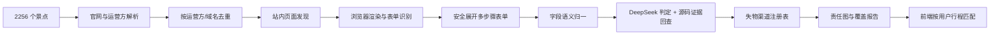
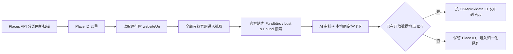

# 柏林景点失物招领表单爬虫设计

## 1. 目标

输入现有的柏林景点数据，先对每一条场所记录给出扫描结果，再持续生成一份
可供产品使用的“失物渠道注册表”：

1. 这个景点由谁负责；
2. 应该使用专用失物表单、运营方统一表单、普通联系表单、邮箱/电话，还是场馆/公共空间指引；
3. 表单要求用户填写哪些内容；
4. 每个结论来自哪个官方页面、何时验证、当前是否仍然有效。

第一阶段的完成标准不是“每个景点都必须找到表单”，而是 2256 条输入必须
全部出现在结果中。能够找到时输出 Lost & Found 页面、HTML 表单 action/
method、公开邮箱或电话；不能找到时明确区分“官网待扫”“官网已扫但没有
入口”“父场馆候选”和“缺少官方来源”。

爬虫只发现和分析表单，不提交真实表单，也不绕过登录、验证码或网站的访问限制。

## 2. 设计原则

- **按运营方爬，不按景点重复爬。** 16 家 Staatliche Museen zu Berlin 场馆可以共用一个运营方渠道。
- **原始证据和产品数据分开。** 保存字段原文、HTML 位置和来源页面，再映射成产品能理解的统一字段。
- **不能确定就降级。** 不把普通联系表单伪装成失物招领表单；父场馆仅凭距离只能标成候选，不能自动继承渠道；中央 Fundbüro 只用于街道、出租车或确实不确定的位置。
- **默认不执行写请求。** 浏览器层拦截 POST、PUT、PATCH、DELETE，防止误提交。
- **所有结论都有时效。** URL、字段和负责机构都保存 `lastVerifiedAt` 与内容指纹，定期复查。

## 3. 总体流程



推荐技术栈：

- undici + cheerio：有界 HTTP 抓取、静态页面分析与候选提取；
- robots-parser：robots 与 sitemap 约束；
- Playwright：按需渲染 JavaScript、读取 iframe、分析动态表单；
- pdfjs-dist：只读抽取官方 PDF 中的失物政策与公开联系方式；
- TypeScript：与当前项目一致；
- JSON/JSONL：保存可审查、可进 Git 的结果；
- 可选 Stagehand/LLM：只处理规则无法判断的字段语义，不负责决定是否提交。

### 3.1 Google Places 作为发现层，开放数据作为地图主索引

不抓取 Google Maps 网页。可选的 `google-discover` 命令调用官方 Places
API，按 `museum`、`art_museum`、`history_museum`、`zoo`、`aquarium`、
`amusement_park`、`castle`、`tourist_attraction` 等类型扫描柏林。由于
Nearby Search 每次最多返回 20 个地点，脚本从 2×2 网格开始；某一格某一
类型返回满 20 条时才继续四分，并用 `--max-requests` 设置计费硬上限。

Google 数据不取代 OSM/Wikidata 主索引：名称、坐标、类型、官网仅在进程
内使用；长期文件只保留允许缓存的 Google Place ID 及其对应的开放数据场所
ID。与旧流程不同，只要 Places 返回有效 `websiteUri`，即使该地点尚未匹配
OSM，也会用临时 ID 进入官网抓取。官网实际返回的页面、字段和证据作为
独立来源保存。未匹配候选被标记为 `pending` 且 `venueIds` 为空，审核和发布
层都不允许它直接进入 App，直到补齐 OSM/Wikidata 场所归属。



### 3.2 一条命令完成全量场所扫描

```bash
npm run data:lost-found:scan-all
```

`scan-all` 先重建 inventory，再按已经核实的运营方或独立官网去重抓取，最后
生成：

- `full-scan.candidates.json`：页面、表单字段、发现路径和证据；
- `venue-endpoint-scan.json`：2256 条逐场所结果，供统计和后续接入 App。

脚本默认断点续跑；每个 owner/site 范围完成后原子写入 checkpoint，临时失败
的范围不会被标成完成。只想利用已有候选重新生成结果时运行
`npm run data:lost-found:scan-report`，不会访问网络。

## 4. 五个处理阶段

### 4.1 景点与运营方解析

现有 `public/berlin-attractions.json` 是输入。首先补齐并生成：

```ts
interface VenueOwnerResolution {
  venueId: string;
  venueName: string;
  officialWebsite?: string;
  operatorId?: string;
  operatorName?: string;
  operatorWebsite?: string;
  confidence: number;
  evidenceUrls: string[];
}
```

信息来源按可信度排序：

1. 人工确认的运营方映射；
2. 景点官网的 Impressum、Kontakt、页脚组织名称；
3. OSM 的 `operator`、`operator:website`；
4. Wikidata 的运营方、所有者、官方网站关系；
5. 域名与页面品牌名称推断。

只有高可信记录才能合并运营方。域名相同不一定代表同一负责机构，例如市政府门户里的不同下属单位。

### 4.2 站内页面发现

每个去重后的官方域名建立一个受限的站内任务：

- 先读取 `robots.txt` 和 sitemap；
- 首页、服务、FAQ、联系页面优先；
- 同域 BFS，默认深度 3、最多 60 页；
- 每域最多 2 个并发请求，间隔 750–1500 ms；
- 不抓新闻归档、图片、视频、日历、购票和无限分页。

页面和链接按德语、英语关键词打分。

高权重词：

```txt
Fundbüro, Fundsache, Fundsachen, verloren, Verlustmeldung,
Gegenstand verloren, liegen gelassen, lost property, lost and found
```

次高权重词：

```txt
Kontakt, Besucherservice, Gästeservice, Hilfe, FAQ, Service
```

负向词：

```txt
Presse, Karriere, Jobs, Datenschutz, Impressum, Shop, Tickets
```

候选页面必须记录发现路径，例如：

```txt
景点官网 → Service → FAQ → “Ich habe etwas verloren”
```

这样自动审核和疑难人工复核时都可以解释爬虫为什么选择该页面。

### 4.3 表单识别与安全展开

先用普通 HTTP 解析静态页面；发现以下情况再启动 Playwright：

- 页面主要内容由 JavaScript 生成；
- 页面存在 iframe；
- 有输入控件但没有标准 `<form>`；
- “下一步”后才显示剩余字段；
- 自定义下拉框、日期组件或文件上传组件。

识别对象包括：

- `<form>`、`input`、`select`、`textarea`、`button`；
- 与字段关联的 `label`、`aria-label`、`aria-describedby`；
- `required`、`pattern`、`min`、`max`、`minlength`、`maxlength`；
- 单选、复选和下拉选项；
- 文件类型、数量和大小说明；
- 当前步骤、条件字段和错误提示；
- CAPTCHA、登录要求、外部表单提供商与跨域 iframe。

多步骤探索规则：

1. 拦截并拒绝所有非 GET 网络请求；
2. 仅向字段填入固定的虚拟数据；
3. 只点击明确标记为 `Weiter`、`Next`、`Fortfahren` 的按钮；
4. 永不点击 `Absenden`、`Submit`、`Meldung senden` 等最终提交按钮；
5. 每个表单最多探索 8 个页面状态；
6. 用 DOM 指纹防止循环；
7. 如果“下一步”依赖 POST，请求会被拦截，记录为 `server_step_blocked` 并进入人工审核。

隐藏字段可以记录字段名和类型，但不得保存 CSRF token、会话值、预填个人数据或 Cookie。

### 4.4 字段提取与语义归一

每个字段同时保存原始信息和统一语义：

```ts
type SemanticField =
  | "lossDate"
  | "lossTime"
  | "lossLocation"
  | "venue"
  | "transitLine"
  | "boardingStop"
  | "alightingStop"
  | "direction"
  | "itemCategory"
  | "itemDescription"
  | "brand"
  | "color"
  | "identifyingFeatures"
  | "estimatedValue"
  | "firstName"
  | "lastName"
  | "email"
  | "phone"
  | "postalAddress"
  | "attachment"
  | "privacyConsent"
  | "other";

interface ExtractedField {
  rawName?: string;
  rawId?: string;
  label: string;
  helpText?: string;
  placeholder?: string;
  control:
    | "text"
    | "textarea"
    | "date"
    | "time"
    | "number"
    | "email"
    | "tel"
    | "radio"
    | "checkbox"
    | "select"
    | "file"
    | "custom";
  required: boolean;
  options?: Array<{ value: string; label: string }>;
  constraints?: {
    pattern?: string;
    min?: string;
    max?: string;
    minLength?: number;
    maxLength?: number;
    acceptedFiles?: string[];
  };
  step: number;
  visibleWhen?: string;
  semanticKey: SemanticField;
  semanticConfidence: number;
  evidenceSelector: string;
}
```

归一分三层完成：

1. HTML 规则：`type=email` 直接映射到 `email`；
2. 德英词典：`Verlustort`、`Wo verloren?` 映射到 `lossLocation`；
3. 低可信字段才交给语义模型判断，模型必须返回置信度和理由。

模型不能改写原始字段，也不能把 `other` 强行映射到已知类别。

### 4.5 渠道判定与发布

最终不是只输出“一个 URL”，而是输出一个有范围和可信度的渠道：

```ts
type ChannelKind =
  | "dedicated_lost_found_form"
  | "operator_lost_found_form"
  | "general_contact_form"
  | "email"
  | "phone"
  | "central_office_fallback"
  | "manual_review";

interface LostFoundChannel {
  id: string;
  operatorId?: string;
  venueIds: string[];
  kind: ChannelKind;
  scope: "venue" | "operator" | "city";
  pageUrl: string;
  formAction?: string;
  language: string[];
  fields: ExtractedField[];
  captcha: boolean;
  loginRequired: boolean;
  crawlStatus:
    | "verified"
    | "candidate"
    | "blocked"
    | "gone"
    | "manual_review";
  confidence: number;
  evidenceUrls: string[];
  discoveredAt: string;
  lastVerifiedAt: string;
  contentHash: string;
}
```

### 4.6 责任图与全量降级

渠道注册表只包含人工接受的数据；它不应假装覆盖所有场所。`coverage`
在其上构建一张一场所一归属的责任图，优先级固定为：

```txt
当前人工审核渠道
→ 经官方证据审计的运营方 / 场馆官网候选
→ 邻近父场馆候选（禁止继承渠道）
→ 场馆与公共空间人工指引
```

详细图保存在私有维护数据中；App 只打包去除冗余后的公开索引。发布运营方
渠道时，只能扩展到同一“官方来源审计”运营方的直属场所。人工指定的
`venueIdsOverride` 优先，`parent_candidate` 永远不参加自动扩展。

2026-07-27 快照为 2256 个场所：41 个当前审核渠道、184 个官方联系候选、
410 个父场馆候选、1621 个人工指引。功能路径覆盖为 100%，但可直接行动的
审核/官方覆盖为 9.97%，两者必须分别报告。

选择渠道的顺序固定为：

```txt
当前审核渠道（专用表单 / 运营方表单 / 邮箱 / 电话）
→ 官方场馆或运营方联系候选
→ 父场馆候选（先核实，不带入表单）
→ 场馆/公共空间指引
```

前端只有审核通过的渠道可以显示为 `verified` 或启用填表辅助。官方联系、
父场馆和人工指引可以作为降级路线展示，但必须保留各自的信任标记，不能
显示成审核过的失物表单。

## 5. 可信度、AI 源码审核与人工兜底

建议把“渠道是否正确”和“字段语义是否正确”分开打分。

渠道评分示例：

- 官方域名：+25；
- 页面标题或正文明确出现失物关键词：+30；
- 表单字段包含丢失时间、地点、物品描述：+25；
- 从官网导航直接到达：+10；
- 运营方名称与景点匹配：+10；
- 只有普通 Kontakt：最高只能达到 60；
- 第三方域名且官网没有明确链接：AI 不得自动接受，进入疑难队列；
- 页面要求付款、登录或出现非预期跳转：AI 不得自动接受，进入疑难队列。

发布门槛：

- `>= 85`：进入 DeepSeek 源码判定，模型结论仍须通过本地确定性守卫；
- `60–84`：进入 DeepSeek 判定，但只有达到单独的 AI 置信度门槛才可发布；
- `< 60`：只保留为线索；
- 新域名无论分数多高，都必须具备官方发现路径，且模型引用必须在当前源码逐字回查。

AI 不能判定或守卫失败时，人工兜底页面至少显示：

- 景点与运营方；
- 候选渠道及发现路径；
- 页面截图；
- 提取出的字段和语义映射；
- 与上次版本的字段差异；
- 接受、拒绝、修改运营方、修改语义四种操作。

## 6. 定期复查

建议分成两个任务：

### 每周轻量检查

- 检查已发布 URL 的 HTTP 状态、重定向和表单指纹；
- 页面未变时不启动完整浏览器；
- URL 404、跨域跳转或表单消失时立即降级，不继续向用户展示为已验证表单。

### 每月完整发现

- 重新读取官网、sitemap 和关键词页面；
- 发现新增或替代渠道；
- 重新提取已变化的表单；
- 生成 Git 可读的差异报告。

每个失败任务使用指数退避，最多重试 3 次。连续三次失败标记为 `blocked`，但保留上一次验证结果及其日期，不静默删除。

## 7. 建议的仓库结构

```txt
scripts/lost-found-crawler/
  cli.mts                 # inventory/discover/coverage/review/publish/verify
  inventory.mts           # 景点和运营方归并
  discovery.mts           # sitemap/BFS/候选页评分
  browser.mts             # Playwright 渲染与请求拦截
  form-extractor.mts      # 原始字段提取
  form-explorer.mts       # 安全展开多步骤表单
  semantics.mts           # 德英词典和统一字段映射
  scoring.mts             # 渠道与字段置信度
  responsibility.mts      # 责任图、覆盖报告、公开索引
  merge.mts               # 分片候选与断点元数据去重合并
  schemas.ts              # 数据类型
  fixtures/               # 保存的测试 HTML

data/lost-found-crawler/
  inventory.json
  operator-overrides.json
  channels.candidates.json
  responsibilities.json
  coverage-report.json

public/
  berlin-lost-found-channels.json
  berlin-lost-found-responsibilities.json
```

浏览器截图、完整 HTML、Cookie 和网络日志不提交到 `public/`。HTML 证据可以短期保存在 CI artifact，设置自动过期。

## 8. 命令设计

```json
{
  "scripts": {
    "data:lost-found:inventory": "node --import tsx scripts/lost-found-crawler/cli.mts inventory",
    "data:lost-found:discover": "node --import tsx scripts/lost-found-crawler/cli.mts discover",
    "data:lost-found:scan-all": "node --import tsx scripts/lost-found-crawler/cli.mts scan-all",
    "data:lost-found:scan-report": "node --import tsx scripts/lost-found-crawler/cli.mts scan-report",
    "data:lost-found:google-discover": "node --import tsx scripts/lost-found-crawler/cli.mts google-discover",
    "data:lost-found:extract": "node --import tsx scripts/lost-found-crawler/cli.mts extract",
    "data:lost-found:ai-review": "node --import tsx scripts/lost-found-crawler/cli.mts ai-review",
    "data:lost-found:coverage": "node --import tsx scripts/lost-found-crawler/cli.mts coverage",
    "data:lost-found:verify": "node --import tsx scripts/lost-found-crawler/cli.mts verify",
    "data:lost-found:publish": "node --import tsx scripts/lost-found-crawler/cli.mts publish"
  }
}
```

本地开发支持限制范围：

```bash
npm run data:lost-found:discover -- --domain=smb.museum --limit=20
npm run data:lost-found:discover -- --resume
npm run data:lost-found:coverage
npm run data:lost-found:extract -- --url=https://example.org/fundbuero
npm run data:lost-found:google-discover -- --dry-run
npm run data:lost-found:google-discover -- --confirm-billing --max-requests=180 --crawl-shards=4
npm run data:lost-found:ai-review -- --limit=25
```

Google 扫描在地点类别之间轮询，先保证博物馆、动物园、城堡、纪念地等每类
都有基础覆盖，再把剩余请求用于细分达到 20 条上限的密集网格。官网抓取默认
分为 4 个并行分片；Google API 请求本身仍遵守 `--max-requests` 总上限。

`ai-review` 通过 `DEEPSEEK_API_KEY` 调用 DeepSeek JSON Output。发送前会删除
脚本、事件属性、样式和表单预填值，并限制源码长度。网页内容按不可信输入
处理；模型引用的失物证据必须能在刚抓取的源码中回查，且本地的官网来源、
适用范围、表单/联系方式和置信度守卫全部通过，才会在 `--apply` 模式写入
接受决定。模型只能批准 `open_only`，不能批准辅助填表或提交适配器；判断
不充分的候选继续留在人工队列。已有决定默认不会被覆盖。

## 9. 测试策略

不要把测试完全依赖在实时网站上。保存去除个人数据后的 HTML fixture，覆盖：

- 标准单页表单；
- JavaScript 动态表单；
- 多步骤表单；
- iframe 表单；
- 条件字段；
- 自定义下拉框；
- CAPTCHA；
- 必须 POST 才能进入下一步；
- 页面改版后字段消失；
- 普通联系表单被误判为失物表单。

核心验收条件：

1. 测试运行期间发出的非 GET 请求数量必须为 0；
2. 不保存字段当前值、Cookie、CSRF token；
3. 只有经官方来源审计的同一运营方直属景点才能复用渠道；
4. 普通联系表单不会被标记成专用失物表单；
5. 表单变化会产生结构化差异；
6. 每个景点最终都有明确结果；父场馆候选不继承表单，无法归属时返回人工指引。
7. 模型输出中的证据无法在当前源码中回查时必须失败关闭，且密钥不得进入日志或数据文件。

## 10. 适合当前项目的实施顺序

### 第一阶段：可用的基础版

- 把现有官网数据归并成运营方/域名；
- undici + cheerio 的有界队列深度 3 发现候选页面，并按 owner/site 写原子断点；
- Playwright 提取标准表单的全部可见字段；
- 规则映射德英常见字段；
- 输出候选 JSON、AI 源码审核报告和疑难候选人工队列。

这一阶段先覆盖当前已有官网的景点，不宣称覆盖全部 2256 个点。

### 第二阶段：提高覆盖率

- 补 Wikidata/OSM 运营方关系；
- 支持 iframe、自定义组件和安全的多步骤探索；
- 增加截图审核界面；
- 把一个运营方的渠道关联到旗下全部景点。
- 用 `coverage` 持续量化审核、官方、父场馆候选和指引四个层级。

### 第三阶段：接入产品

- 只发布通过源码回查和本地确定性守卫的审核渠道；
- 用户输入当天行程后自动匹配所有景点与交通运营方；
- 产品根据表单 schema 提前收集一次信息；
- 打开官网表单时生成逐字段填写指引。

即使已经知道字段，也不应立即实现任意网站的自动提交。自动提交还需要逐站点适配、用户最终确认、验证码处理、服务条款检查和可追踪的提交回执，应该作为独立系统设计。
